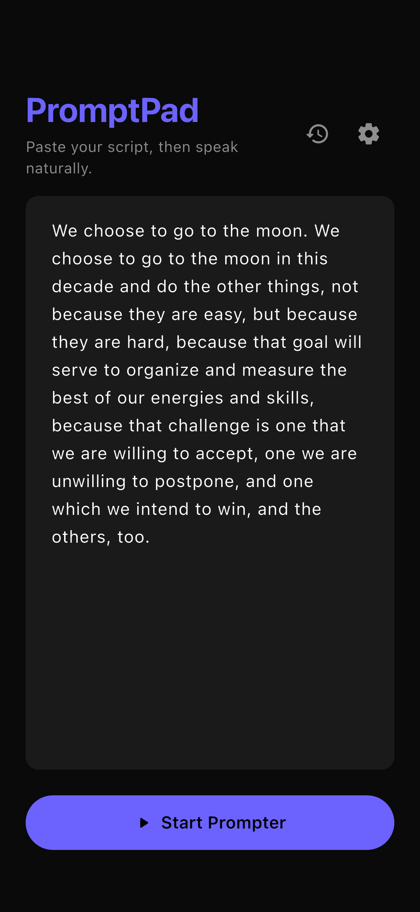

# PromptPad

An auto-following teleprompter app for iOS and Android. Paste your script, speak naturally — the app listens and tracks your position in real time.

No fixed scroll speed. No foot pedal. Just your voice.

> Born from a last-minute need to give a presentation — vibe-coded into existence with AI in a weekend.

[**中文文档**](README_zh.md)

<p align="center">
  
</p>

## Features

- **Voice-driven tracking** — Real-time speech recognition matches your spoken words against the script and auto-scrolls to keep up
- **Two tracking algorithms** — Classic (fast, low overhead) and Advanced (beam search with drift recovery)
- **Multi-language support** — English, Chinese, Japanese, Korean, Spanish, French, German, Portuguese, and more
- **On-device recognition (iOS)** — iOS supports on-device ASR for offline use; Android has not implemented offline recognition and requires a network connection
- **Mirror mode** — Horizontal flip for teleprompter glass/beam splitter setups
- **Smart recovery** — Phonetic matching (Double Metaphone), tail-match re-anchoring, and automatic resync when you go off-script
- **Markdown support** — Paste markdown scripts; headings become section markers, bold/italic is stripped for clean display
- **Script history** — Quickly reload your last 5 scripts
- **Screen management** — Wakelock and max brightness while running

## Getting Started

### Platform Support

| Platform | Status |
|----------|--------|
| iOS | Primarily developed and tested on iOS |
| Android | Builds and runs, but has not been thoroughly tested. Offline speech recognition is not implemented. Contributions and bug reports welcome! |

### Prerequisites

- [Flutter](https://docs.flutter.dev/get-started/install) SDK >= 3.2.0
- iOS 15+ or Android 5.0+

### Build & Run

```bash
git clone https://github.com/Yukk1No/promptpad.git
cd promptpad
flutter pub get
flutter run
```

### Build for release

```bash
flutter build ios        # iOS
flutter build apk        # Android
```

## How It Works

1. **Paste** your script on the home screen
2. **Tap Start** — the app begins listening
3. **Speak naturally** — words highlight as you go, the display auto-scrolls
4. Use **left/right arrows** to skip sentences, **+/-** to adjust font size

The matching engine runs a three-layer pipeline:

1. **Greedy matching** — Character-level and word-level fuzzy matching from the current position
2. **Tail-match** — Last few spoken words are searched ahead to correct small drifts
3. **Recovery** — Sentence-ahead resync and anchor-based beam search for when you skip ahead or go off-script

## Settings

| Setting | Description |
|---------|------------|
| Language / Locale | Speech recognition language (10 languages) |
| Tracking Algorithm | Classic (V1) or Advanced with beam search (V2) |
| On-device recognition | Use on-device ASR models (iOS only; no effect on Android) |
| Default Font Size | Initial display size (28–56pt, adjustable during playback) |

## Inspiration

PromptPad was inspired by two excellent open-source teleprompter projects:

- [promptme-ai](https://github.com/larsbaunwall/promptme-ai) — Browser-based teleprompter with voice-driven, fuzzy-matching script tracking. PromptPad's Double Metaphone phonetic matching approach was influenced by this project.
- [Textream](https://github.com/f/textream) — A polished macOS teleprompter for streamers and podcasters. PromptPad's character-level tracking algorithm was originally ported from Textream's approach.

## License

[MIT](LICENSE)
